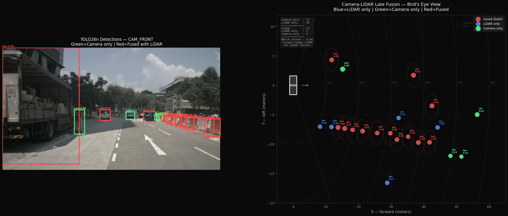
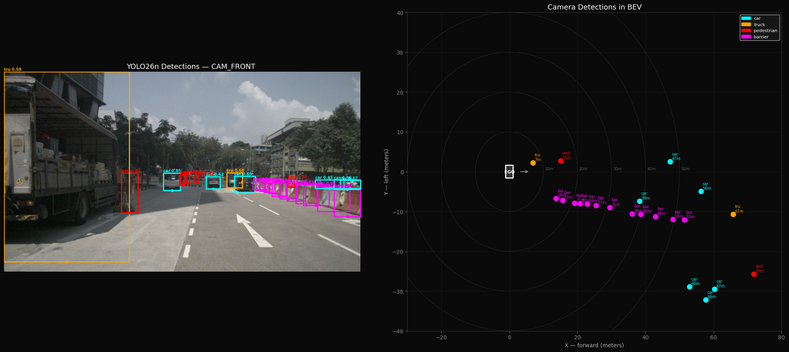
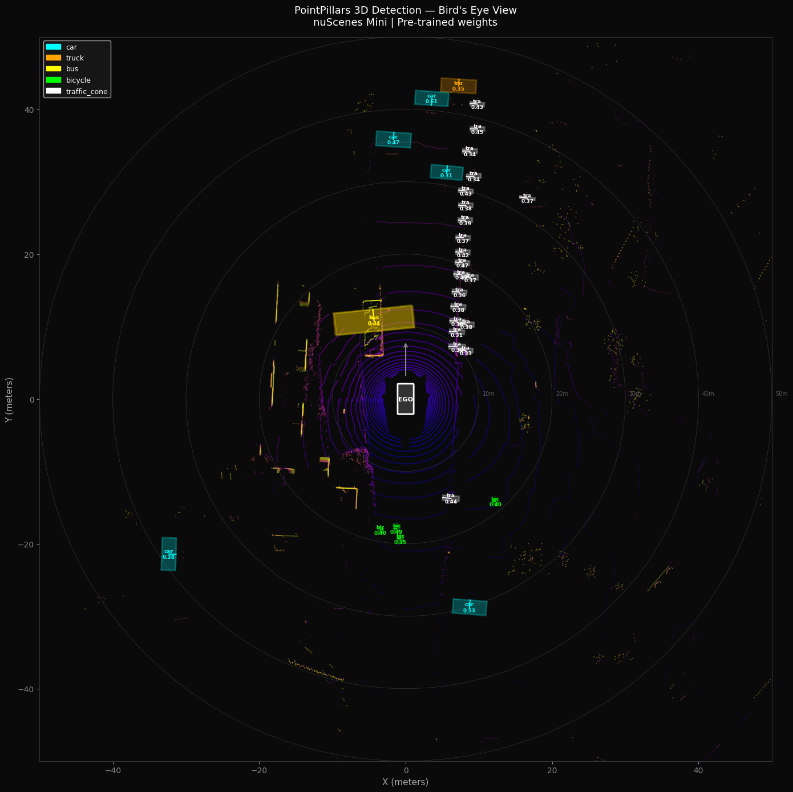

# EdgeDrive Perception

Edge AI perception pipeline for real-time autonomous driving on Jetson Orin Nano Super.

Covers the full pipeline from dataset preparation to edge deployment:
camera detection, LiDAR 3D detection, sensor fusion, quantization,
and TensorRT C++ deployment.

Designed for low-cost edge hardware (~$260) under strict power (<10W)
and latency (<50 ms) constraints.

---

## Why this project

Modern autonomous driving systems must balance accuracy, latency, and power.

This project explores those trade-offs by building a full perception pipeline
optimized for edge deployment, where GPU resources are limited and
real-time constraints are strict.

This project focuses on real-world deployment constraints rather than
maximizing benchmark accuracy.

---

## Demo

### Camera-LiDAR Late Fusion — Bird's Eye View

PointPillars 3D detections fused with YOLO26n 2D detections on
nuScenes Mini. Blue = LiDAR only | Green = Camera only | Red = Fused.



### YOLO26n Object Detection — nuScenes Front Camera + Bird's Eye View



### PointPillars BEV — Point Cloud + 3D Boxes



---

## Architecture

```
┌──────────────────────────────────────────────────────────────────┐
│                     EdgeDrive Perception                         │
├────────────────────────────┬─────────────────────────────────────┤
│  Camera Pipeline           │  LiDAR Pipeline                     │
│                            │                                     │
│  nuScenes CAM_FRONT        │  nuScenes LIDAR_TOP                 │
│       ↓                    │       ↓                             │
│  YOLO26n (fine-tuned)      │  PointPillars (pre-trained)         │
│  2D detection + segmask    │  3D detection in BEV                │
│       ↓                    │       ↓                             │
│  Ground plane → BEV (x,y)  │  LiDAR→Ego transform                │
│                            │                                     │
├────────────────────────────┴─────────────────────────────────────┤
│                    Late Fusion in BEV                            │
│         Class-aware distance matching (12m threshold)            │
│         Fused score: 0.6 × LiDAR + 0.4 × Camera                  │
├──────────────────────────────────────────────────────────────────┤
│                 Quantization & Export                            │
│   PTQ FP32→FP16→INT8  |  QAT  |  ONNX  |  TFLite  |  TensorRT    │
├──────────────────────────────────────────────────────────────────┤
│        Jetson Orin Nano Super Deployment  (in progress)          │
│         C++ TensorRT  |  30+ FPS  |  <10W  |  Live Camera        │
└──────────────────────────────────────────────────────────────────┘
```

---

## Results

### YOLO Model Comparison (nuScenes Mini, 100 epochs)

| Model | Task | mAP50 | mAP50-95 | Params | Size |
|---|---|---|---|---|---|
| YOLO26n-det | Detection | 0.558 | 0.343 | 2.5M | 5.1 MB |
| YOLO26n-seg | Det + Seg | 0.594 | 0.360 | 2.9M | 6.2 MB |
| YOLOv8n-det | Detection | 0.671 | 0.409 | 3.2M | 5.9 MB |

YOLO26n chosen for Jetson deployment despite lower FP32 mAP because
its NMS-free head eliminates post-processing latency and shows superior
quantization robustness (INT8 improves over FP32).

### Quantization Results (YOLO26n-det)

| Format | mAP50 | vs FP32 | Size |
|---|---|---|---|
| FP32 (baseline) | 0.5668 | — | 5.1 MB |
| FP16 TFLite | 0.5704 | +0.0036 | 4.8 MB |
| INT8 PTQ | **0.5713** | **+0.0045** | 2.7 MB |
| INT8 QAT | 0.5700 | +0.0032 | 2.7 MB |

INT8 PTQ improves over FP32, suggesting quantization acts as a
regularizer on the small dataset. QAT showed no further improvement, 
confirming PTQ is sufficient for this architecture.

### PointPillars (published, full nuScenes val)

| Metric | Value |
|---|---|
| mAP | 0.354 |
| NDS | 0.476 |

### Camera-LiDAR Fusion (nuScenes Mini, sample 1)

| | Count |
|---|---|
| Camera detections | 17 |
| LiDAR detections | 18 |
| Fused matches | 13 |
| LiDAR-only | 5 |
| Camera-only | 4 |

### Fusion Strategy

Fusion is performed on single-frame detections without temporal tracking.
Class-aware nearest-neighbor matching is performed in BEV (12m threshold).
Fused confidence:

Score = 0.6 × LiDAR + 0.4 × Camera

LiDAR is weighted higher due to more reliable spatial localization,
while camera contributes semantic confidence.

### Solutions API Demos (nuScenes Front Camera)

Five real-time analytics demos built on YOLO26n using the Ultralytics
Solutions API, validated on nuScenes driving video:

| Demo | Output |
|---|---|
| Heatmap | Spatial density of all detections across frames |
| Object Counting | Per-class counts with crossing line detection |
| Analytics | Real-time bar chart of detection distribution |
| Speed Estimation | Per-object velocity (stationary camera only) |
| Segmentation | Instance masks using YOLO26n-seg |

See [`solutions/README.md`](solutions/README.md) for demos.

### Jetson Orin Nano Super Benchmarks

Planned deployment on Jetson Orin Nano Super:

- TensorRT INT8 inference
- Real-time pipeline (target: 30+ FPS, <10W)
- Power and thermal benchmarking

Results to be updated after Jetson Orin Nano Super deployment

---

## Hardware

| Component | Spec | Cost |
|---|---|---|
| Edge compute | Jetson Orin Nano Super 8GB Developer Kit | ~$250 |
| Camera | USB webcam (1080p) | ~$10 |
| Total | | **~$260** |

Training: Google Colab (Tesla T4 GPU, free tier)

---

## Repository Structure

```
EdgeDrive-Perception/
├── training/              ← YOLO fine-tuning, quantization, pruning
│   ├── convert_nuscenes_det.py
│   ├── convert_nuscenes_seg.py
│   ├── train_yolo26n.py
│   ├── train_yolo26n_seg.py
│   ├── train_yolov8n.py
│   ├── export_all_formats.py
│   ├── quantize.py
│   ├── prune.py
│   └── README.md
├── solutions/             ← YOLO Solutions API demos
│   ├── heatmap_demo.py
│   ├── object_counting_demo.py
│   ├── analytics_demo.py
│   ├── speed_estimation_demo.py
│   ├── segmentation_demo.py
│   └── README.md
├── fusion/                ← PointPillars + Camera-LiDAR fusion
│   ├── train_pointpillars.py
│   ├── pointpillars_inference.py
│   ├── bev_visualization.py
│   ├── camera_to_bev.py
│   ├── late_fusion.py
│   ├── fusion_evaluation.py
│   └── README.md
├── deployment/            ← Jetson TensorRT C++ pipeline (to be completed)
│   └── src/
├── notebooks/
│   └── development_walkthrough.ipynb
├── docs/
└── benchmarks/
```

---

## Quick Start

### 1. Dataset

Download nuScenes Mini v1.0 from https://www.nuscenes.org (free, ~4GB).

### 2. Training

```bash
cd training

# Convert nuScenes annotations to YOLO format
python convert_nuscenes_det.py --nuscenes_root /data/sets/nuscenes

# Train YOLO26n
python train_yolo26n.py --data ./data/nuscenes_det/nuscenes.yaml

# Export all formats
python export_all_formats.py --runs_dir ./runs
```

### 3. PointPillars

Requires PyTorch 2.1.0 + mmcv 2.1.0 (see `fusion/README.md`):

```bash
cd fusion
python train_pointpillars.py --nuscenes_root /data/sets/nuscenes
python pointpillars_inference.py --mode single --nuscenes_root /data/sets/nuscenes
```

### 4. Fusion

```bash
python camera_to_bev.py --nuscenes_root /data/sets/nuscenes --sample_idx 1
# Full fusion pipeline: see notebooks/development_walkthrough.ipynb
```

### 5. Quantization

```bash
python training/quantize.py --mode ptq --runs_dir ./runs
```

---

## Pre-trained Weights

Model weights are not stored in this repository.

**Download from Google Drive:** *(link to be added)*

Or reproduce by running the training scripts above.
Training time: ~70 min per model on Tesla T4 (Google Colab).

---

## Development Walkthrough

The complete development process including all debugging steps,
design decisions, and intermediate results is documented in:

[`notebooks/development_walkthrough.ipynb`](notebooks/development_walkthrough.ipynb)

Key decisions documented:
- Why YOLO26n over YOLOv8n for edge deployment
- coordinate transform bugs (global→ego→camera)
- Sample-level vs scene-level dataset split
- Single-sweep LiDAR limitation on nuScenes Mini
- Greedy matching failures in late fusion and fixes
- Structured pruning attempt and why INT8 PTQ is sufficient

---

## Key Design Decisions

**YOLO26n over YOLOv8n for deployment:**
YOLOv8n achieves higher mAP50 (0.671 vs 0.558) on small data, but
YOLO26n's NMS-free head removes post-processing latency on Jetson,
shows better INT8 robustness (+0.45% mAP), and produces tighter
latency variance — critical for real-time autonomous driving.

**Late fusion over BEVFusion:**
BEVFusion (unified camera-LiDAR network) achieves higher mAP but
requires ~200MB model and runs at ~5 FPS on Jetson Orin Nano Super 8GB (67 TOPS).
Late fusion runs at 30+ FPS under 10W while keeping each modality
independently debuggable — the correct tradeoff for edge deployment.

**PTQ over QAT:**
QAT showed no improvement over PTQ for YOLO26n (early stopping at
epoch 1). YOLO26n's anchor-free architecture is inherently
quantization-robust, making the expensive QAT fine-tuning loop
unnecessary.

---

## Background

End-to-end autonomous driving perception stack built to demonstrate
edge AI engineering capability — from dataset preparation and model
training through quantization, sensor fusion, and Jetson deployment.

Developed on a ~$260 hardware budget (Jetson Orin Nano Super 8GB + USB webcam)
using Google Colab for training. All code written from scratch on nuScenes,
the same dataset used in real industry Co-MLOps research pipeline.
