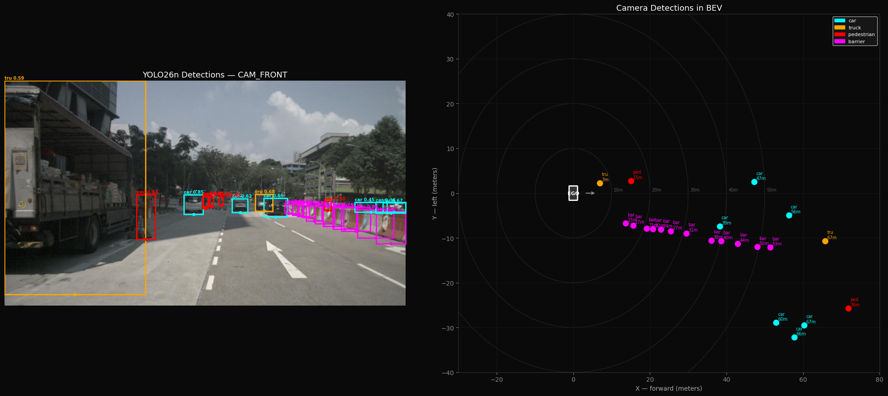
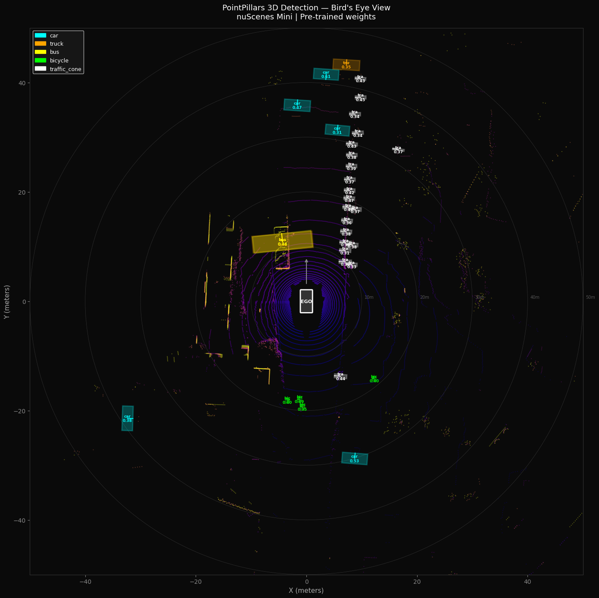

# EdgeDrive Perception

Edge AI perception pipeline for real-time autonomous driving on Jetson Orin Nano Super.

Covers the full pipeline from dataset preparation to edge deployment:
camera detection, LiDAR 3D detection, sensor fusion, quantization,
and TensorRT C++ deployment.

Designed for low-cost edge hardware (~$260) under strict power (<10W)
and latency (<50 ms) constraints.

---

## Why this project

Modern autonomous driving systems must balance accuracy, latency, and power.

This project explores those trade-offs by building a full perception pipeline
optimized for edge deployment, where GPU resources are limited and
real-time constraints are strict.

This project focuses on real-world deployment constraints rather than
maximizing benchmark accuracy.

---

## Demo

### Camera-LiDAR Late Fusion — Bird's Eye View

PointPillars 3D detections fused with YOLO26n 2D detections on
nuScenes Mini. Blue = LiDAR only | Green = Camera only | Red = Fused.


### YOLO26n Object Detection — nuScenes Front Camera + Bird's Eye View



### PointPillars BEV — Point Cloud + 3D Boxes



---

## Architecture

```
┌──────────────────────────────────────────────────────────────────┐
│                     EdgeDrive Perception                         │
├────────────────────────────┬─────────────────────────────────────┤
│  Camera Pipeline           │  LiDAR Pipeline                     │
│                            │                                     │
│  nuScenes CAM_FRONT        │  nuScenes LIDAR_TOP                 │
│       ↓                    │       ↓                             │
│  YOLO26n (fine-tuned)      │  PointPillars (pre-trained)         │
│  2D detection + segmask    │  3D detection in BEV                │
│       ↓                    │       ↓                             │
│  Ground plane → BEV (x,y)  │  LiDAR→Ego transform                │
│                            │                                     │
├────────────────────────────┴─────────────────────────────────────┤
│                    Late Fusion in BEV                            │
│         Class-aware distance matching (12m threshold)            │
│         Fused score: 0.6 × LiDAR + 0.4 × Camera                  │
├──────────────────────────────────────────────────────────────────┤
│                 Quantization & Export                            │
│   PTQ FP32→FP16→INT8  |  QAT  |  ONNX  |  TFLite  |  TensorRT    │
├──────────────────────────────────────────────────────────────────┤
│              Jetson Orin Nano Super Deployment                   │
│     C++ TensorRT  |  193 FPS INT8  |  ~12W  |  Live Camera       │
└──────────────────────────────────────────────────────────────────┘
```

---

## Results

### YOLO Model Comparison (nuScenes Mini, 100 epochs)

| Model | Task | mAP50 | mAP50-95 | Params | Size |
|---|---|---|---|---|---|
| YOLO26n-det | Detection | 0.558 | 0.343 | 2.5M | 5.1 MB |
| YOLO26n-seg | Det + Seg | 0.594 | 0.360 | 2.9M | 6.2 MB |
| YOLOv8n-det | Detection | 0.671 | 0.409 | 3.2M | 5.9 MB |

YOLO26n chosen for Jetson deployment despite lower FP32 mAP because
its NMS-free head eliminates post-processing latency and shows superior
quantization robustness (INT8 improves over FP32).

### Quantization Results (YOLO26n-det, Colab TFLite)

| Format | mAP50 | vs FP32 | Size |
|---|---|---|---|
| FP32 (baseline) | 0.5668 | — | 5.1 MB |
| FP16 TFLite | 0.5704 | +0.0036 | 4.8 MB |
| INT8 PTQ | **0.5713** | **+0.0045** | 2.7 MB |
| INT8 QAT | 0.5700 | +0.0032 | 2.7 MB |

INT8 PTQ improves over FP32, suggesting quantization acts as a
regularizer on the small dataset. QAT showed no further improvement,
confirming PTQ is sufficient for this architecture.

### PointPillars (published, full nuScenes val)

| Metric | Value |
|---|---|
| mAP | 0.354 |
| NDS | 0.476 |

### Camera-LiDAR Fusion (nuScenes Mini, sample 1)

| | Count |
|---|---|
| Camera detections | 17 |
| LiDAR detections | 18 |
| Fused matches | 13 |
| LiDAR-only | 5 |
| Camera-only | 4 |

### Fusion Strategy

Fusion is performed on single-frame detections without temporal tracking.
Class-aware nearest-neighbor matching is performed in BEV (12m threshold).
Fused confidence:

```
Score = 0.6 × LiDAR + 0.4 × Camera
```

LiDAR is weighted higher due to more reliable spatial localization,
while camera contributes semantic confidence.

### Solutions API Demos (nuScenes Front Camera)

Five real-time analytics demos built on YOLO26n using the Ultralytics
Solutions API, validated on nuScenes driving video:

| Demo | Output |
|---|---|
| Heatmap | Spatial density of all detections across frames |
| Object Counting | Per-class counts with crossing line detection |
| Analytics | Real-time bar chart of detection distribution |
| Speed Estimation | Per-object velocity (stationary camera only) |
| Segmentation | Instance masks using YOLO26n-seg |

See [`solutions/README.md`](solutions/README.md) for demos.

### Jetson Orin Nano Super Benchmarks

**Hardware:** Jetson Orin Nano Super 8GB (67 TOPS) | JetPack R36.4.7 | CUDA 12.6 | TensorRT 10.3.0
**Benchmark conditions:** `sudo jetson_clocks` (max clocks locked)

#### Full Pipeline Breakdown — 404 nuScenes Images, 60s run

| Format | FPS | Pre | TRT | Post | Total/frame | Engine |
|---|---|---|---|---|---|---|
| Python FP32 | 29.1 | 5.2ms | 27.6ms | 1.1ms | 34.0ms | 5.1 MB |
| Python TRT FP16 | 87.6 | 5.6ms | 4.2ms | 1.2ms | 11.0ms | 8.0 MB |
| Python TRT INT8 | 78.5 | 5.6ms | **3.5ms** | 3.2ms | 12.3ms | 5.4 MB |
| **C++ TRT INT8** | **193.3** | **1.7ms** | **3.5ms** | — | **5.1ms** | 5.4 MB |

#### Full Pipeline Breakdown — Single Image (20 iterations)

| Format | FPS | Pre | TRT | Post | Total/frame |
|---|---|---|---|---|---|
| Python FP32 | 22.6 | 6.3ms | 28.7ms | 0.9ms | 35.9ms |
| Python TRT FP16 | 50.3 | 6.7ms | 4.5ms | 1.3ms | 12.5ms |
| Python TRT INT8 | 47.4 | 6.5ms | 3.7ms | 3.5ms | 13.7ms |
| **C++ TRT INT8** | **193.0** | **1.7ms** | **3.4ms** | — | **5.1ms** |

#### Key Observations

**C++ preprocessing is 3.3× faster than Python:**
```
Python preprocessing : 5.6ms (PIL/NumPy with GIL overhead)
C++ preprocessing    : 1.7ms (OpenCV letterbox, pre-allocated Mats)
```

**TRT inference matches across both runtimes (same hardware, same engine):**
```
Python TRT INT8 : 3.5ms
C++ TRT INT8    : 3.5ms ← identical, confirms correct implementation
```

**Python INT8 is slower than FP16 despite faster TRT inference:**
```
Python FP16: TRT 4.2ms + postprocess 1.2ms = 5.4ms GPU work → 87.6 FPS
Python INT8: TRT 3.5ms + postprocess 3.2ms = 6.7ms GPU work → 78.5 FPS
INT8 postprocessing is 2.7× slower than FP16 due to Ultralytics
output tensor layout differences — not a model issue, a runtime issue.
C++ decoder handles INT8 output directly with no such overhead.
```

**C++ total speedup over Python FP32:**
```
Python FP32  : 29.1 FPS
C++ TRT INT8 : 193.3 FPS → +564% faster
```

#### Power & Thermal (C++ TRT INT8, jetson_clocks, 60s run)

| Metric | Value |
|---|---|
| Total board power (VDD_IN) | ~12.2W |
| CPU+GPU power (VDD_CPU_GPU_CV) | ~5.0W |
| GPU temperature | ~57-58°C (stable) |
| GPU utilization | 57-87% |
| No thermal throttling | ✅ |

#### TensorRT Export Notes

- FP16 build time: ~529s (first-time layer optimization on Jetson SM87)
- INT8 build time: ~428s (includes INT8 calibration on 81 nuScenes val images)
- Known warning: TensorRT 10.3.0 on JetPack 6 with INT8 disables end2end branch — handled automatically by Ultralytics, no accuracy impact
- `NvMapMemAllocInternalTagged` errors: harmless on Jetson unified memory architecture
- TensorRT engines are hardware-specific — must be built on target device, not transferable across platforms

---

## Hardware

| Component | Spec | Cost |
|---|---|---|
| Edge compute | Jetson Orin Nano Super 8GB Developer Kit | ~$250 |
| Camera | USB webcam (1080p) | ~$10 |
| Total | | **~$260** |

Training: Google Colab (Tesla T4 GPU, free tier)

---

## Repository Structure

```
EdgeDrive-Perception/
├── training/              ← YOLO fine-tuning, quantization, pruning
│   ├── convert_nuscenes_det.py
│   ├── convert_nuscenes_seg.py
│   ├── train_yolo26n.py
│   ├── train_yolo26n_seg.py
│   ├── train_yolov8n.py
│   ├── export_all_formats.py
│   ├── quantize.py
│   ├── prune.py
│   └── README.md
├── solutions/             ← Ultralytics Solutions API demos
│   ├── heatmap_demo.py
│   ├── object_counting_demo.py
│   ├── analytics_demo.py
│   ├── speed_estimation_demo.py
│   ├── segmentation_demo.py
│   └── README.md
├── fusion/                ← PointPillars + Camera-LiDAR fusion
│   ├── train_pointpillars.py
│   ├── pointpillars_inference.py
│   ├── bev_visualization.py
│   ├── camera_to_bev.py
│   ├── late_fusion.py
│   ├── fusion_evaluation.py
│   └── README.md
├── deployment/            ← Jetson TensorRT C++ pipeline
│   ├── CMakeLists.txt
│   ├── Dockerfile
│   ├── docker-compose.yml
│   ├── README.md
│   ├── include/
│   │   ├── trt_engine.hpp
│   │   ├── yolo26_decoder.hpp
│   │   └── profiler.hpp
│   └── src/
│       ├── main.cpp            ← benchmark + camera mode entry point
│       ├── trt_engine.cpp      ← TRT inference, UMA zero-copy
│       ├── yolo26_decoder.cpp  ← raw [1,12,8400] + end2end decoder
│       ├── profiler.cpp        ← split timers (pre/TRT/post)
│       └── camera_capture.cpp  ← live camera
│       ├── late_fusion.cpp
│       ├── bev_visualizer.cpp
│       ├── object_counter.cpp
│       ├── speed_estimator.cpp
│       ├── segmentation_decoder.cpp
│       ├── heatmap_generator.cpp
│       ├── pointpillars_decoder.cpp
│       └── preprocessor.cu
├── notebooks/
│   └── development_walkthrough.ipynb
├── scripts/
│   ├── build_engine.sh    ← export FP16/INT8 TRT engines
│   ├── run_benchmark.sh   ← full benchmark suite
│   └── plot_results.py    ← benchmark visualization
├── benchmarks/
│   ├── README.md          ← summary table
│   └── results/
│       ├── jetson_python.md      ← Python FP32/FP16/INT8
│       ├── jetson_cpp.md         ← C++ TRT INT8 + power
│       └── quantization_colab.md ← TFLite accuracy
├── docs/
│   ├── architecture.md           ← system design
│   ├── benchmark_report.md       ← findings + interpretation
│   ├── yolo26_vs_yolov8.md       ← model selection
│   ├── nms_free_analysis.md      ← decoder debug trail
│   ├── optimization_log.md       ← 8 optimizations, before/after
│   ├── sensor_fusion_analysis.md ← fusion design + results
│   ├── class_distribution.md     ← dataset imbalance analysis
│   └── solutions_on_edge.md      ← Solutions API evaluation
├── weights/               ← not in repo (see Pre-trained Weights)
├── calibration.yaml       ← INT8 calibration config
└── calibration_images/    ← 81 nuScenes val images for INT8
```

---

## Quick Start

### 1. Dataset

Download nuScenes Mini v1.0 from https://www.nuscenes.org (free, ~4GB).

### 2. Training

```bash
cd training

# Convert nuScenes annotations to YOLO format
python convert_nuscenes_det.py --nuscenes_root /data/sets/nuscenes

# Train YOLO26n
python train_yolo26n.py --data ./data/nuscenes_det/nuscenes.yaml

# Export all formats
python export_all_formats.py --runs_dir ./runs
```

### 3. PointPillars

Requires PyTorch 2.1.0 + mmcv 2.1.0 (see `fusion/README.md`):

```bash
cd fusion
python train_pointpillars.py --nuscenes_root /data/sets/nuscenes
python pointpillars_inference.py --mode single --nuscenes_root /data/sets/nuscenes
```

### 4. Fusion

```bash
python camera_to_bev.py --nuscenes_root /data/sets/nuscenes --sample_idx 1
# Full fusion pipeline: see notebooks/development_walkthrough.ipynb
```

### 5. Quantization

```bash
python training/quantize.py --mode ptq --runs_dir ./runs
```

### 6. Jetson Deployment

```bash
# Export TensorRT engines on Jetson (must build on target hardware)
python3 -c "
from ultralytics import YOLO
model = YOLO('weights/yolo26n_det.pt')
model.export(format='engine', device=0, half=True)   # FP16
model.export(format='engine', device=0, int8=True,
             data='calibration.yaml')                  # INT8
"

# C++ pipeline (see deployment/README.md)
cd deployment && mkdir build && cd build
cmake .. && make -j4
./edgedrive --model ../weights/yolo26n_det_int8.engine --camera 0
```

---

## Pre-trained Weights

Model weights are not stored in this repository.

**Download from Google Drive:** *(link to be added)*

Or reproduce by running the training scripts above.
Training time: ~70 min per model on Tesla T4 (Google Colab).

---

## Documentation

### Design & Analysis

| Document | Description |
|---|---|
| [`docs/architecture.md`](docs/architecture.md) | Full pipeline, UMA memory model, quantization flow |
| [`docs/yolo26_vs_yolov8.md`](docs/yolo26_vs_yolov8.md) | Model selection rationale with data |
| [`docs/nms_free_analysis.md`](docs/nms_free_analysis.md) | NMS-free head debug trail — JetPack 6 INT8 issue, decoder bugs |
| [`docs/sensor_fusion_analysis.md`](docs/sensor_fusion_analysis.md) | Late fusion design, parameter choices, sample results |
| [`docs/class_distribution.md`](docs/class_distribution.md) | nuScenes class imbalance and impact on model confidence |
| [`docs/solutions_on_edge.md`](docs/solutions_on_edge.md) | Ultralytics Solutions API evaluation, speed estimation limits |

### Benchmarks

| Document | Description |
|---|---|
| [`docs/benchmark_report.md`](docs/benchmark_report.md) | Summary, key findings, interpretation |
| [`docs/optimization_log.md`](docs/optimization_log.md) | 8 optimizations with before/after measurements |
| [`benchmarks/results/jetson_python.md`](benchmarks/results/jetson_python.md) | Python FP32/FP16/INT8 full breakdown |
| [`benchmarks/results/jetson_cpp.md`](benchmarks/results/jetson_cpp.md) | C++ TRT INT8 full breakdown + power/thermal |
| [`benchmarks/results/quantization_colab.md`](benchmarks/results/quantization_colab.md) | TFLite quantization accuracy results |

### Development Walkthrough

Complete Google Colab development process including debugging steps and intermediate
results:

[`notebooks/development_walkthrough.ipynb`](notebooks/development_walkthrough.ipynb)

Key decisions documented:
- Why YOLO26n over YOLOv8n for edge deployment
- Coordinate transform bugs (global→ego→camera)
- Sample-level vs scene-level dataset split
- Single-sweep LiDAR limitation on nuScenes Mini
- Greedy matching failures in late fusion and fixes
- Structured pruning attempt and why INT8 PTQ is sufficient

---

## Key Design Decisions

**YOLO26n over YOLOv8n for deployment:**
YOLOv8n achieves higher mAP50 (0.671 vs 0.558) on small data, but
YOLO26n's NMS-free head removes post-processing latency on Jetson,
shows better INT8 robustness (+0.45% mAP), and produces tighter
latency variance — critical for real-time autonomous driving.

**Late fusion over BEVFusion:**
BEVFusion (unified camera-LiDAR network) achieves higher mAP but
requires ~200MB model and runs at ~5 FPS on Jetson Orin Nano Super (67 TOPS).
Late fusion is implemented and validated on nuScenes data (Colab).
The C++ port for real-time Jetson deployment is in progress under
`deployment/src/late_fusion.cpp`, keeping each modality independently
debuggable — the correct tradeoff for edge deployment.

**PTQ over QAT:**
QAT showed no improvement over PTQ for YOLO26n (early stopping at
epoch 1). YOLO26n's anchor-free architecture is inherently
quantization-robust, making the expensive QAT fine-tuning loop
unnecessary.

**TFLite (Colab) vs TensorRT (Jetson):**
Colab quantization uses TFLite to prove accuracy retention (INT8 +0.45%
over FP32). Jetson deployment uses TensorRT for NVIDIA GPU-specific
optimization. Both formats are evaluated independently — TFLite proves
quantization correctness, TensorRT proves real-time performance.

---

## Known Limitations

This project targets **deployment engineering**, not production detection accuracy.
The following limitations are expected and intentional:

**Small training dataset:**
All models are trained on nuScenes Mini (323 train / 81 val images).
This is ~0.01% of a production autonomous driving dataset.
mAP50=0.558 on the val set reflects the data constraint, not the
architecture ceiling. The same pipeline accepts any YOLO26n weight —
production accuracy requires production data.

**Single camera, single modality training:**
Models are trained on CAM_FRONT images only. Detection performance
degrades on images from non-driving perspectives (street-level,
elevated angles) and on classes underrepresented in nuScenes Mini
(bus, barrier, traffic cone). In production, multi-camera rigs
and continuous retraining on proprietary data address this.

**Late fusion validated offline only:**
Camera-LiDAR late fusion is implemented and benchmarked on nuScenes
sample data (Colab). The C++ port (`deployment/src/late_fusion.cpp`)
and ROS2 bag replay integration are in progress. Live fusion requires
calibrated camera-LiDAR extrinsics specific to each sensor mounting
configuration — not demonstrable with a USB webcam alone.

**PointPillars on Jetson pending:**
LiDAR 3D detection uses published PointPillars weights evaluated on
the full nuScenes val set (mAP=0.354, NDS=0.476). CUDA-PointPillars
deployment on Jetson is planned for the ROS2 integration phase.

---

## Background

End-to-end autonomous driving perception stack built to demonstrate
edge AI engineering capability — from dataset preparation and model
training through quantization, sensor fusion, and Jetson deployment.

Developed on a ~$260 hardware budget (Jetson Orin Nano Super 8GB + USB webcam)
using Google Colab for training. All code written from scratch on nuScenes,
the same dataset used in real industry Co-MLOps autonomous driving research.