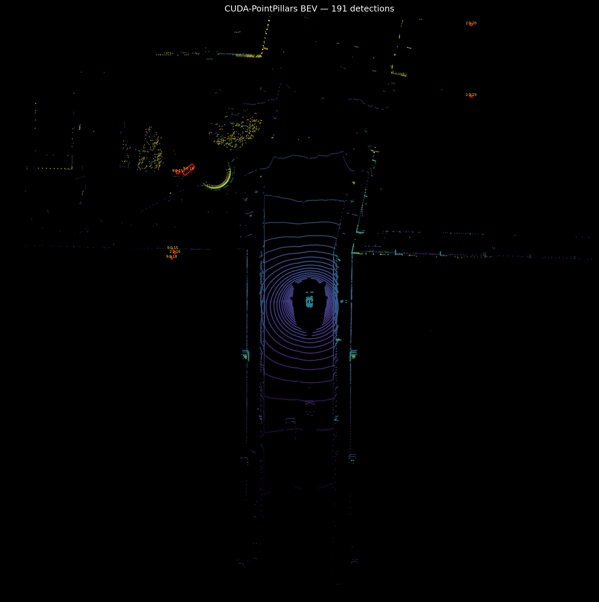
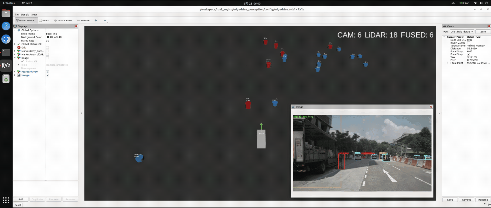
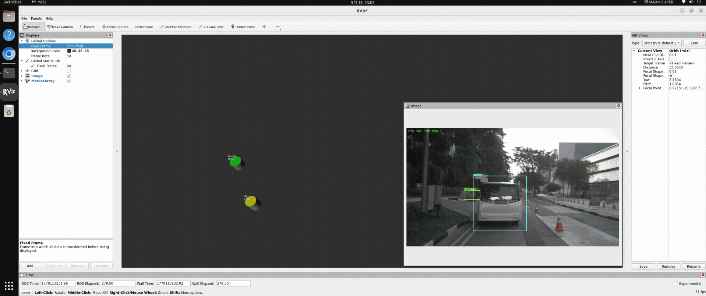
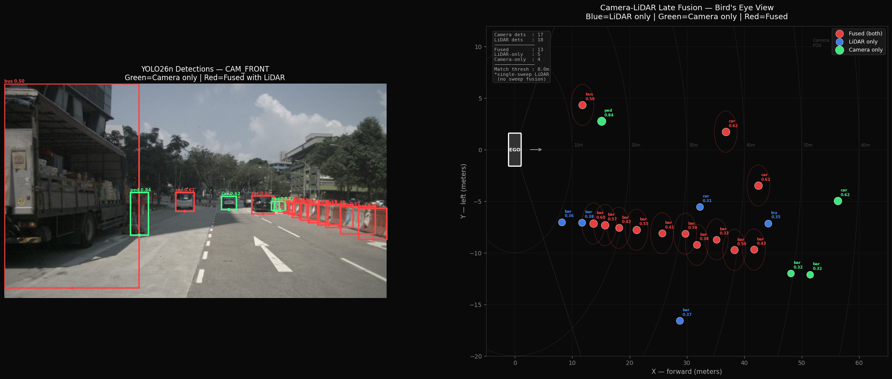
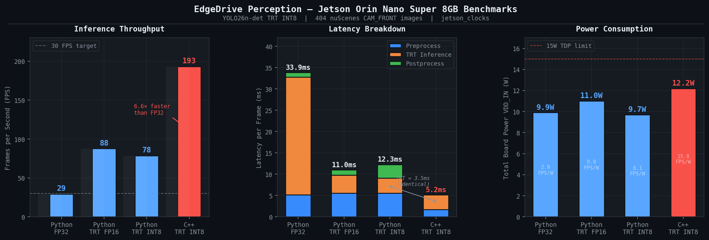

# EdgeDrive Perception

**Real-time camera + LiDAR 3D perception — deployed and fused live on a ~$260 Jetson Orin Nano Super.**

Two detectors run concurrently in hand-written C++/TensorRT — **YOLO26n** (2D, INT8) and **CUDA-PointPillars FPN3** (3D LiDAR, FP16) — time-synced and **fused in BEV**, wrapped as a **ROS2 Humble** pipeline, and shipped in **Docker**. The hard part was porting NVIDIA's CUDA-PointPillars across a **full JetPack 5→6 / TensorRT 8→10 / KITTI→nuScenes generation gap** and making two TensorRT engines co-exist inside a 15–25 W envelope. Every latency and power figure below is **measured on-device** (`sudo jetson_clocks`).

📹 [Camera demo](https://youtu.be/zx4OrOlAXBs) · [Video demo](https://youtu.be/UsOV8r5H1lY) · [footage source](https://www.youtube.com/watch?v=qPgWV8Rxemo)

---

## Highlights — what was hard here

- **Ported NVIDIA CUDA-PointPillars to a new toolchain generation and dataset.** JetPack 5.x→6.x, TensorRT 8.x→**10.3**, CUDA 11.4→12.6, C++14→17, KITTI→**nuScenes (10 classes)**, and single-level→**3-level FPN** (10 TRT bindings). Wrote a **CHW scatter CUDA kernel** and run VFE/scatter in C++ so the TRT engine carries only SECOND + FPN + head.
- **Debugged real on-device CUDA/memory failures.** Fixed an NMS `h_mask_` allocation that ballooned to **12.8 GB** on dense urban frames (→ 128 KB by capping `nms_pre=1000`), added a **zero-detection guard** (0 CUDA grid blocks were crashing `nms_launch`), and fixed an unsigned-counter bounds bug.
- **Live camera-LiDAR late fusion.** Two TensorRT engines running **concurrently** in ROS2 under a 25 W power mode, time-synced with `message_filters` ApproximateTime, matched in BEV, visualized in RViz2 — not an offline notebook.
- **Full deployment surface.** A ROS2 Humble package (3 nodes + launch + pre-loaded RViz config) and a **two-container Docker** setup (lean production runtime vs. R&D image), mirroring OTA-style edge deployment.
- **Zero-copy C++ TensorRT runtime.** Jetson UMA pinned-mapped memory (no `cudaMemcpy` in the hot path), pre-allocated buffers, `enqueueV3` / `setTensorAddress` (TRT 10.x API), allocation-free per-frame decode.
- **Camera path** (supporting): YOLO26n TensorRT INT8 at **~200 FPS / ~8 W**, with a hand-written decoder **~32× faster** than the Python/Ultralytics equivalent.

---

## System at a glance

| Subsystem     | Model                            | Precision | On-device performance                   | Notes                                    |
| ------------- | -------------------------------- | --------- | --------------------------------------- | ---------------------------------------- |
| **LiDAR 3D**  | CUDA-PointPillars FPN3           | FP16      | **37–45 FPS** (25–30 ms)                | nuScenes 10-class, 100 m range, ~43K pts |
| **Fusion**    | BEV late fusion (dual engine)    | —         | live @ bag rate, **40–100% match**      | needs 25 W mode for 2 concurrent engines |
| **Camera 2D** | YOLO26n (NMS-free)               | INT8      | **~200 FPS** @ ~8 W                     | 1280×720, USB camera                     |
| **Runtime**   | hand-written C++/TensorRT + CUDA | —         | UMA zero-copy, allocation-free hot path | TRT 10.3 · JetPack 6 · SM87              |

**Hardware:** Jetson Orin Nano Super 8GB (67 TOPS), ~$250 + ~$10 USB webcam. **Training:** Google Colab (Tesla T4). **Benchmark conditions:** `sudo jetson_clocks` (clocks locked).

> This project targets **deployment engineering** — zero-copy memory, INT8/FP16, multi-engine scheduling, and containerized edge delivery — not benchmark-topping accuracy. Models are trained on nuScenes Mini and the pipeline accepts any production weight.

---

## The hard part: porting CUDA-PointPillars

NVIDIA's [CUDA-PointPillars](https://github.com/NVIDIA-AI-IOT/CUDA-PointPillars) targets KITTI on JetPack 5.x (TRT 8.x, CUDA 11.4, C++14). Running our **nuScenes-trained mmdetection3d FPN3 model** on JetPack 6.x required a generation-level port plus full 3-level FPN support.

| File                            | Change                                                                                                                                                                                                               |
| ------------------------------- | -------------------------------------------------------------------------------------------------------------------------------------------------------------------------------------------------------------------- |
| `tensorrt.cpp`                  | Full **TRT 10.x** API port (binding API removed in TRT 10 → `getNbIOTensors`, `enqueueV3`)                                                                                                                           |
| `lidar-backbone.cu`             | **CHW scatter kernel** + FPN3 backbone engine (10 bindings, 3 output levels)                                                                                                                                         |
| `lidar-backbone.hpp`            | Multi-level virtual accessors (`cls1/box1/dir1`, `cls2/box2/dir2`, `is_fpn3()`)                                                                                                                                      |
| `pointpillar.cpp` / `.hpp`      | `max_levels` core param; postprocess on all FPN levels, anchors scaled per level, results merged                                                                                                                     |
| `lidar-postprocess.cu` / `.hpp` | **NCHW-correct decode** for cls/box/dir (`channel·HW + loc`, anchor-major to match mmdet3d `Anchor3DHead`); nuScenes 10 classes / 8 anchors / bbox code-size 9; NMS safety cap; zero-detection guard; `nms_pre=1000` |
| `main.cpp` / `CMakeLists.txt`   | nuScenes voxelization + FPN3 engine path; `-std=c++17`                                                                                                                                                               |

**Why a 3-level FPN was required:** the single-level export (feat[0] only) missed **all cars and large objects** — they're detected at level 1 (100×100, ×2 anchor scale) and level 2 (50×50, ×4 anchor scale).

| Level | Grid    | Anchor scale | Primary detections                         |
| ----- | ------- | ------------ | ------------------------------------------ |
| 0     | 200×200 | ×1           | pedestrian, bicycle, traffic_cone, barrier |
| 1     | 100×100 | ×2           | car, construction_vehicle                  |
| 2     | 50×50   | ×4           | truck, bus, trailer                        |

**On-device NMS crash fixes (real debugging trail):**

- **`h_mask_` OOM** — original allocates `det_num × DIVUP(det_num,64) × 8` bytes; at level 0 (`det_num`=320,000) that's **12.8 GB**. Capping `nms_pre=1000` brings it to **128 KB**.
- **Zero-detection guard** — `nms_launch` launches 0 grid blocks when no boxes survive threshold → crash. Added an early return.
- **Unsigned bounds bug** — `bndbox_num_` is unsigned, so a `<= 0` check is always false; switched to an upper-bound `> det_num_` check.

Full details, setup, and the FPN3 engine build: [`cuda-pointpillars-patches/README.md`](cuda-pointpillars-patches/README.md).

---

## Demo

### 1 · LiDAR 3D Detection — CUDA-PointPillars FPN3 on Jetson (~37–45 FPS)

> NVIDIA CUDA-PointPillars patched for SM87 + TRT 10.3.0, running our nuScenes-trained FPN3 model.
> Full pipeline: voxelization → CHW scatter → TRT FPN3 backbone (3 levels) → NMS → detections.
> Detects all 10 nuScenes classes across the full 100 m × 100 m range.



```
Voxelization   :  0.2ms
Backbone+Head  : 13-17ms  (TRT FP16, FPN3 — 3 feature levels)
Decoder+NMS    :  8-12ms
Total          : 25-30ms  (~37-45 FPS)

Input  : nuScenes LiDAR (43,440 points)
Output : 140-191 detections per frame
Classes: all 10 nuScenes classes (car, pedestrian, bicycle, truck, bus, ...)
```

```bash
# Setup and run
cd cuda-pointpillars/build
export CUDASM=87
./pointpillar ../data/ ../data/ --timer
```

See [`cuda-pointpillars-patches/README.md`](cuda-pointpillars-patches/README.md) for full instructions.

### 2 · Camera-LiDAR Late Fusion — live in ROS2 / RViz2

> Real-time late fusion on the Orin. nuScenes bag replayed through `camera_node` (YOLO26n TRT INT8)
> and `lidar_detection_node` (CUDA-PointPillars FPN3 TRT FP16), fused in BEV.
> Red = fused · Green = camera only · Blue = LiDAR only. Live CAM / LiDAR / FUSED count per frame.



```
camera_node  : YOLO26n TRT INT8   ~180 FPS                  →  /detections/camera
lidar_node   : CUDA-PP FPN3 FP16  ~37 FPS                   →  /detections/lidar
fusion_node  : BEV distance match 8m thresh ~2 FPS bag rate →  /visualization/fused
Match rate   : 40–100% of camera detections fused per frame
```

```bash
sudo nvpmodel -m 2   # 25W mode — required for dual TRT engines
sudo jetson_clocks
xhost +local:docker
./scripts/run_ros2_rviz_demo.sh
```

### 3 · ROS2 Pipeline + RViz2 — Camera detections in 3D BEV (MarkerArray)

> Full ROS2 pipeline with 3D visualization. Colored cylinders = camera detections projected to the
> ground plane; labels show class + distance. RViz2 config auto-loads — no manual setup.



```
Right  : /camera/annotated — detection boxes + FPS HUD
Left   : /detections/camera_markers — 3D cylinders in BEV
        car (yellow) · pedestrian (red) · bus (cyan) · barrier (magenta)
        Cylinder height = confidence score · Label = class + estimated distance
```

```bash
# Headless bag → TRT → detections
python3 scripts/nuscenes_to_ros2bag.py --dataroot /data/sets/nuscenes --output bags/nuscenes_scene0
sudo jetson_clocks
./scripts/run_ros2_bag_demo.sh
```

### 4 · Camera 2D Detection — YOLO26n TensorRT INT8 (~200 FPS, supporting)

> C++ TRT INT8 pipeline running inside a Docker container on the Orin. USB webcam on Tokyo footage.

📹 **[Watch: Live Camera Demo](https://youtu.be/zx4OrOlAXBs)** · **[Video Inference Demo](https://youtu.be/UsOV8r5H1lY)**

```
Camera        : USB webcam, 1280×720 @ 30 FPS
Frames        : 13,785
Mean FPS      : 203.4
Preprocess    : 1.1ms
TRT inference : 3.7ms
Total power   : 8.03W (VDD_IN)  ← under 10W at real-world load
GPU load      : 19–39%  @  54.7°C   |   CPU load: 6% @ 55.7°C
RAM           : ~200MB inference overhead (1.9GB total)
```

### 5 · Camera-LiDAR Fusion — offline reference (Colab)

> PointPillars 3D + YOLO26n 2D on nuScenes Mini. Blue = LiDAR only · Green = camera only · Red = fused.



See [`fusion/README.md`](fusion/README.md) for details.

---

## Architecture

```
┌──────────────────────────────────────────────────────────────────┐
│                     EdgeDrive Perception                         │
├────────────────────────────┬─────────────────────────────────────┤
│  Camera Pipeline           │  LiDAR Pipeline                     │
│  nuScenes CAM_FRONT        │  nuScenes LIDAR_TOP                 │
│       ↓                    │       ↓                             │
│  YOLO26n (fine-tuned)      │  PointPillars FPN3 (mmdetection3d)  │
│  2D detection + segmask    │  3D detection — 10 classes, 100m    │
│       ↓                    │       ↓                             │
│  Ground plane → BEV (x,y)  │  LiDAR→Ego  transform               │
├────────────────────────────┴─────────────────────────────────────┤
│              Late Fusion in BEV — ROS2 + Colab                   │
│    BEV distance matching (8m) | 40–100% cam dets matched/frame   │
│         Fused score: 0.6 × LiDAR + 0.4 × Camera                  │
├──────────────────────────────────────────────────────────────────┤
│                   Quantization & Export                          │
│    PTQ FP32→FP16→INT8  |  QAT  |  ONNX  |  TFLite  |  TensorRT   │
├──────────────────────────────────────────────────────────────────┤
│          Dockerized Jetson Orin Nano Super Deployment            │
├────────────────────────────┬─────────────────────────────────────┤
│  C++ TRT (edgedrive)       │  CUDA-PointPillars FPN3             │
│  202 FPS INT8 | ~8.03W     │  ~37-45 FPS | 25-30ms               │
│  Live USB camera           │  43K pts | 10 classes | 100m range  │
├────────────────────────────┴─────────────────────────────────────┤
│               ROS2 Humble Pipeline (edgedrive-ros2)              │
│  camera_node ~180 FPS  |  lidar_detection_node ~37 FPS           │
│  fusion_node BEV matching  |  RViz2 BEV visualization            │
└──────────────────────────────────────────────────────────────────┘
```

---

## Results

### On-device latency — LiDAR (CUDA-PointPillars FPN3, TRT FP16)

```
                    KITTI data (~19K pts)    nuScenes data (~43K pts)
Voxelization      :  0.2ms                   0.2ms
Backbone+Head     : 12-15ms                  13-17ms  (FPN3, 3 levels)
Decoder+NMS       :  6-11ms                  8-12ms   (per-level, merged)
Total (warm)      : 20-25ms  (~45 FPS)       25-30ms  (~37 FPS)
Detections        : 6-58 / frame             140-191 / frame
```

`max_levels` defaults to **3 (full FPN3)** and is used as-is in both the standalone binary and the ROS2 pipeline, so trucks/buses/trailers (the coarse FPN levels) are detected live. The knob can drop to 2 or 1 to trade large-object recall for memory, but the deployment does not lower it.

### On-device latency — Camera (C++ vs Python, why C++)

Same hardware, same engine. The takeaway is that the engine is identical across runtimes — the speedup is in preprocessing and the decoder, which is where deployment engineering lives.

| Format                         | FPS       | Pre       | TRT       | Post       | Total/frame | Engine |
| ------------------------------ | --------- | --------- | --------- | ---------- | ----------- | ------ |
| **C++ TRT INT8 (USB camera)**  | **202.6** | **1.1ms** | **3.7ms** | **~0.1ms** | **4.8ms**   | 5.4 MB |
| **C++ TRT INT8 (video NVDEC)** | **195.2** | **1.2ms** | **4.1ms** | **~0.1ms** | **5.3ms**   | 5.4 MB |
| C++ TRT INT8 (Benchmark)       | 193.3     | 1.7ms     | 3.5ms     | ~0.1ms     | 5.1ms       | 5.4 MB |
| Python TRT INT8 (Benchmark)    | 78.5      | 5.6ms     | **3.5ms** | 3.2ms      | 12.3ms      | 5.4 MB |
| Python TRT FP16 (Benchmark)    | 87.6      | 5.6ms     | 4.2ms     | 1.2ms      | 11.0ms      | 8.0 MB |
| Python FP32 (Benchmark)        | 29.1      | 5.2ms     | 27.6ms    | 1.1ms      | 34.0ms      | 5.1 MB |

```
TRT inference is identical across runtimes (3.5ms) — confirms correct C++ implementation.
C++ preprocessing  : 1.7ms  vs  Python 5.6ms  (PIL/NumPy + GIL)        → 3.3× faster
C++ decoder        : ~0.1ms vs  Python INT8 postprocess 3.2ms          → 32× faster
  (raw-pointer 8400-anchor loop, cxcywh→xyxy, score filter, class-agnostic NMS)
End-to-end         : C++ TRT INT8 202.6 FPS  vs  Python FP32 29.1 FPS  → +596%

Benchmark uses 1600×900 nuScenes images. USB camera and video use 1280×720 → faster preprocessing.
```

### Quantization (YOLO26n-det, Colab TFLite)

| Format          | mAP50      | vs FP32     | Size   |
| --------------- | ---------- | ----------- | ------ |
| FP32 (baseline) | 0.5668     | —           | 5.1 MB |
| FP16 TFLite     | 0.5704     | +0.0036     | 4.8 MB |
| INT8 PTQ        | **0.5713** | **+0.0045** | 2.7 MB |
| INT8 QAT        | 0.5700     | +0.0032     | 2.7 MB |

INT8 PTQ slightly improves over FP32 — quantization acting as a regularizer on the small dataset. QAT added nothing, confirming PTQ suffices for this anchor-free architecture. (TFLite proves quantization correctness on Colab; TensorRT proves real-time performance on Jetson — evaluated independently.)

### Model selection (nuScenes Mini, 100 epochs)

| Model       | Task      | mAP50 | mAP50-95 | Params | Size   |
| ----------- | --------- | ----- | -------- | ------ | ------ |
| YOLO26n-det | Detection | 0.558 | 0.343    | 2.5M   | 5.1 MB |
| YOLO26n-seg | Det + Seg | 0.594 | 0.360    | 2.9M   | 6.2 MB |
| YOLOv8n-det | Detection | 0.671 | 0.409    | 3.2M   | 5.9 MB |

YOLO26n chosen over the higher-mAP YOLOv8n because its **NMS-free head** removes post-processing latency on Jetson, shows better INT8 robustness, and gives tighter latency variance — the right call for real-time edge deployment.

### LiDAR reference accuracy & fusion (nuScenes)

| PointPillars (published, full val) | Value |     | Fusion (nuScenes Mini, sample 1) | Count      |
| ---------------------------------- | ----- | --- | -------------------------------- | ---------- |
| mAP                                | 0.354 |     | Camera / LiDAR detections        | 17 / 18    |
| NDS                                | 0.476 |     | Fused / cam-only / LiDAR-only    | 13 / 4 / 5 |

### Power & thermal

| Condition                          | FPS       | VDD_IN    | CPU+GPU  | GPU %  | Temp  |
| ---------------------------------- | --------- | --------- | -------- | ------ | ----- |
| **USB camera (30 FPS real-world)** | **202.6** | **8.03W** | **2.0W** | 19-39% | ~55°C |
| Video + NVDEC (no VNC)             | 195.2     | ~10.2W    | ~3.0W    | 31-42% | ~56°C |
| Benchmark (jetson_clocks, stress)  | 193.3     | ~12.2W    | ~5.0W    | 57-87% | ~58°C |

```
Base idle 7.3W  +  USB camera 0.7W = 8.03W (real deployment)  |  stress max 12.2W (synthetic)
```

**Under real 30 FPS camera load, the pipeline stays under 10W** —
the 12.2W benchmark figure is a synthetic maximum, not typical deployment power.

### Benchmark Plot



_Generated by `python3 scripts/plot_results.py --save`_

### TensorRT Export Notes

- FP16 build time: ~529s (first-time layer optimization on Jetson SM87)
- INT8 build time: ~428s (includes INT8 calibration on 81 nuScenes val images)
- Known warning: TensorRT 10.3.0 on JetPack 6 with INT8 disables end2end branch — handled automatically by Ultralytics, no accuracy impact
- `NvMapMemAllocInternalTagged` errors: harmless on Jetson unified memory architecture
- TensorRT engines are hardware-specific — must be built on target device, not transferable across platforms

---

## Hardware

| Component    | Spec                                     | Cost      |
| ------------ | ---------------------------------------- | --------- |
| Edge compute | Jetson Orin Nano Super 8GB Developer Kit | ~$250     |
| Camera       | USB webcam (1080p)                       | ~$10      |
| Total        |                                          | **~$260** |

Training: Google Colab (Tesla T4 GPU, free tier)

---

## Repository structure

```
EdgeDrive-Perception/
├── cuda-pointpillars-patches/   ← ★ patches for NVIDIA-AI-IOT/CUDA-PointPillars
│   ├── README.md                ← setup + architecture + performance
│   ├── tensorrt.cpp             ← TRT 10.x API (getNbIOTensors, enqueueV3)
│   ├── lidar-backbone.hpp       ← FPN3 multi-level virtual accessors
│   ├── lidar-backbone.cu        ← CHW scatter kernel + FPN3 backbone (10 bindings)
│   ├── pointpillar.hpp          ← max_levels CoreParameter
│   ├── pointpillar.cpp          ← 3-level postprocess + merge
│   ├── lidar-postprocess.cu     ← NMS safety cap, zero-det guard, nms_pre=1000
│   ├── lidar-postprocess.hpp    ← nuScenes 10 classes, 8 anchors, bbox_code=9
│   └── main.cpp                 ← nuScenes voxelization + FPN3 engine path
├── deployment/            ← Jetson TensorRT C++ pipeline
│   ├── CMakeLists.txt
│   ├── README.md          ← build + run instructions
│   ├── include/
│   │   ├── trt_engine.hpp           ← TRT inference + UMA zero-copy
│   │   ├── yolo26_decoder.hpp       ← raw [1,12,8400] + end2end decoder
│   │   ├── camera_capture.hpp       ← USB / CSI / video / NVDEC / BEV
│   │   ├── bev_visualizer.hpp       ← ground plane BEV projection
│   │   ├── profiler.hpp             ← split timers (pre/TRT/post)
│   │   ├── heatmap_generator.hpp    ← detection frequency heatmap
│   │   ├── object_counter.hpp       ← line/zone crossing counter
│   │   ├── speed_estimator.hpp      ← centroid tracker + km/h
│   │   ├── segmentation_decoder.hpp ← YOLO26n-seg mask decoder
│   │   └── preprocessor.cuh         ← CUDA letterbox kernel
│   └── src/
│       ├── main.cpp                 ← entry point, CLI args
│       ├── trt_engine.cpp           ← TRT engine, enqueueV3, UMA
│       ├── yolo26_decoder.cpp       ← cxcywh decode, NMS, draw
│       ├── camera_capture.cpp       ← capture loop, NVDEC, BEV, HUD
│       ├── bev_visualizer.cpp       ← range rings, ego car, projection
│       ├── profiler.cpp             ← rolling window stats
│       ├── heatmap_generator.cpp    ← Gaussian accumulator (ref)
│       ├── object_counter.cpp       ← line crossing counter (ref)
│       ├── speed_estimator.cpp      ← displacement → km/h (ref)
│       ├── segmentation_decoder.cpp ← mask coefficients × protos (ref)
│       └── preprocessor.cu          ← CUDA letterbox kernel (ref)
├── docker/                ← Container deployment
│   ├── Dockerfile                   ← production C++ runtime (multi-stage)
│   ├── Dockerfile.ros2              ← ROS2 Humble + CUDA-PointPillars
│   ├── docker-compose.yml           ← camera/video/benchmark services
│   ├── docker-compose.ros2.yml      ← camera-node/lidar-node/bag-replay/rviz
│   ├── ros2_entrypoint.sh           ← sources ROS2 + workspace + LD_LIBRARY_PATH
│   ├── .dockerignore
│   └── README.md
├── ros2_ws/               ← ROS2 Humble package
│   └── src/
│   │    └── edgedrive_perception/
│   │       ├── package.xml
│   │       ├── CMakeLists.txt       ← links libpointpillar_core.so
│   │       ├── include/edgedrive_perception/
│   │       │   ├── camera_node.hpp          ← YOLO26n detection node
│   │       │   └── lidar_detection_node.hpp ← CUDA-PointPillars ROS2 node
│   │       ├── src/
│   │       │   ├── camera_node.cpp          ← TRT inference + MarkerArray
│   │       │   ├── lidar_detection_node.cpp ← PointPillars FPN3 + blue MarkerArray
│   │       │   └── fusion_node.cpp          ← BEV matching, red/green/blue markers
│   │       ├── launch/
│   │       │   └── camera.launch.py
│   │       └── config/
│   │           ├── camera_node.yaml
│   │           └── edgedrive.rviz           ← camera + LiDAR + fusion displays pre-loaded
│   └── README.md
├── training/              ← YOLO fine-tuning, quantization, pruning
│   ├── python scripts     ← python / colab scripts reference
│   └── README.md
├── solutions/             ← Ultralytics Solutions API demos
│   ├── python scripts     ← python / colab scripts reference
│   └── README.md
├── fusion/                ← PointPillars + Camera-LiDAR fusion
│   ├── python scripts     ← python / colab scripts reference
│   └── README.md
├── notebooks/
│   └── development_walkthrough.ipynb  ← Complete Google Colab notebook
├── scripts/
│   ├── build_engine.sh              ← export FP16/INT8 TRT engines
│   ├── run_benchmark.sh             ← full benchmark suite
│   ├── test_camera.sh               ← all camera/video/BEV test modes
│   ├── test_ros2_camera.sh          ← test camera_node with synthetic image
│   ├── run_ros2_bag_demo.sh         ← headless bag → TRT → detections
│   ├── run_ros2_rviz_demo.sh        ← bag + camera + lidar + RViz2 (1 container)
│   ├── setup_cuda_pointpillars.sh   ← clone, patch, build, engine in one command
│   ├── nuscenes_to_ros2bag.py       ← convert nuScenes → ROS2 .db3 bag
│   ├── make_test_video.py           ← stitch nuScenes images → .mp4
│   ├── hardware_monitor.py          ← real-time Jetson hardware monitor
│   └── plot_results.py              ← benchmark visualization
├── bags/                  ← not in repo (generated by nuscenes_to_ros2bag.py)
│   └── nuscenes_scene0/   ← nuScenes scene 0, camera + LiDAR, 39 frames @ 2Hz
├── benchmarks/
│   ├── README.md          ← summary table
│   ├── plots/
│   │   └── benchmark_results.png
│   └── results/
│       ├── jetson_python.md      ← Python FP32/FP16/INT8
│       ├── jetson_cpp.md         ← C++ TRT INT8 + power/thermal
│       └── quantization_colab.md ← TFLite accuracy results
├── docs/
│   ├── architecture.md           ← full pipeline + UMA + quantization
│   ├── benchmark_report.md       ← findings + interpretation
│   ├── yolo26_vs_yolov8.md       ← model selection rationale
│   ├── nms_free_analysis.md      ← decoder debug trail (5 bugs)
│   ├── optimization_log.md       ← 11 optimizations + 1 rejected
│   ├── sensor_fusion_analysis.md ← late fusion design + results
│   ├── class_distribution.md     ← dataset imbalance analysis
│   └── solutions_on_edge.md      ← Solutions API evaluation
│   └── ros2_architecture.md      ← ROS2 node graph, QoS, CUDA-PP pipeline
├── demo/
│   └── screenshots/
│       ├── training/
│       │   └── yolo26n_detection.png
│       ├── fusion/
│       │   └── fusion_bev_final.png
│       └── ros2/
│           ├── rviz2_camera_markers.gif  ← live RViz2 camera MarkerArray
│           └── pointpillars_bev.png      ← CUDA-PointPillars BEV on Jetson
├── weights/               ← not in repo (see Pre-trained Weights)
├── calibration.yaml       ← INT8 calibration config (81 images)
└── calibration_images/    ← nuScenes val images for INT8 calibration
```

---

## Quick Start

### 1. Dataset

Download nuScenes Mini v1.0 from https://www.nuscenes.org (free, ~4GB).

### 2. Training

```bash
cd training

# Convert nuScenes annotations to YOLO format
python convert_nuscenes_det.py --nuscenes_root /data/sets/nuscenes

# Train YOLO26n
python train_yolo26n.py --data ./data/nuscenes_det/nuscenes.yaml

# Export all formats
python export_all_formats.py --runs_dir ./runs
```

### 3. PointPillars

Requires PyTorch 2.1.0 + mmcv 2.1.0 (see `fusion/README.md`):

```bash
cd fusion
python train_pointpillars.py --nuscenes_root /data/sets/nuscenes
python pointpillars_inference.py --mode single --nuscenes_root /data/sets/nuscenes
```

### 4. Fusion

```bash
python camera_to_bev.py --nuscenes_root /data/sets/nuscenes --sample_idx 1
# Full fusion pipeline: see notebooks/development_walkthrough.ipynb
```

### 5. Quantization

```bash
python training/quantize.py --mode ptq --runs_dir ./runs
```

### 6. Jetson Deployment

**Option A — Docker (recommended):**

```bash
# Build image on Jetson (~10-15 min, compiles C++ inside container)
cd ~/EdgeDrive-Perception
docker build -t edgedrive:latest -f docker/Dockerfile .

# Run live camera
docker compose -f docker/docker-compose.yml run --rm camera

# Run pre-recorded video
docker compose -f docker/docker-compose.yml run --rm video

# Run benchmark
docker compose -f docker/docker-compose.yml run --rm benchmark
```

**Option B — Native (no Docker):**

```bash
# Export TensorRT engines (must build on target Jetson)
./scripts/build_engine.sh all

# Build C++ pipeline
cd deployment && mkdir -p build && cd build
cmake .. && make -j4

# Run
./edgedrive --engine weights/yolo26n_det_int8_raw.engine --camera 0 --bev
```

See [`deployment/README.md`](deployment/README.md) and [`docker/README.md`](docker/README.md) for full instructions.

### 7. ROS2 Pipeline Demo

```bash
# Generate nuScenes bag (one time)
python3 scripts/nuscenes_to_ros2bag.py \
    --dataroot /data/sets/nuscenes \
    --version v1.0-mini \
    --output bags/nuscenes_scene0 \
    --scene-idx 0

# Build ROS2 container
docker build -t edgedrive-ros2:latest -f docker/Dockerfile.ros2 .

# Run headless pipeline (bag → TRT → detections)
sudo jetson_clocks
./scripts/run_ros2_bag_demo.sh

# Run with RViz2 visualization (camera + LiDAR + fusion + RViz2)
sudo nvpmodel -m 2    # 25W mode — required for dual TRT engines
xhost +local:docker
./scripts/run_ros2_rviz_demo.sh
```

### 8. CUDA-PointPillars LiDAR Demo

```bash
# Export FPN3 ONNX from mmdetection3d (see fusion/train_pointpillars.py)
# Copy to weights/ then run one-command setup:
./scripts/setup_cuda_pointpillars.sh

# Run on nuScenes LiDAR data
cp /data/sets/nuscenes/samples/LIDAR_TOP/<frame>.pcd.bin \
   cuda-pointpillars/data/
cd cuda-pointpillars/build && export CUDASM=87
./pointpillar ../data/ ../data/ --timer
# Expected: ~25-30ms total, detections saved to ../data/*.txt
```

See [`cuda-pointpillars-patches/README.md`](cuda-pointpillars-patches/README.md) for full instructions.

**Pre-trained weights:** [Google Drive](https://drive.google.com/drive/folders/1e8lLJFoN3HOKB0HIsvc6w_RRpekOgi-n?usp=sharing) (not stored in-repo). Or reproduce via the training scripts (~70 min/model on a T4).

---

## Documentation

| Document                                                                                                        | Description                                                  |
| --------------------------------------------------------------------------------------------------------------- | ------------------------------------------------------------ |
| [`cuda-pointpillars-patches/README.md`](cuda-pointpillars-patches/README.md)                                    | ★ CUDA-PointPillars port, FPN3 engine build, NMS crash fixes |
| [`deployment/README.md`](deployment/README.md)                                                                  | C++ build, all CLI args, BEV, Solutions reference            |
| [`docker/README.md`](docker/README.md)                                                                          | Docker build, all run modes, volume mounts                   |
| [`ros2_ws/README.md`](ros2_ws/README.md)                                                                        | ROS2 package, nodes, topics, quick start                     |
| [`docs/ros2_architecture.md`](docs/ros2_architecture.md)                                                        | ROS2 node graph, QoS, nuScenes pipeline, performance         |
| [`docs/architecture.md`](docs/architecture.md)                                                                  | Full pipeline, UMA memory model, quantization flow           |
| [`docs/optimization_log.md`](docs/optimization_log.md)                                                          | 11 optimizations + 1 rejected, before/after data             |
| [`docs/nms_free_analysis.md`](docs/nms_free_analysis.md)                                                        | NMS-free decoder debug trail — 5 bugs found and fixed        |
| [`docs/sensor_fusion_analysis.md`](docs/sensor_fusion_analysis.md)                                              | Late fusion design, coordinate transforms, ROS2 results      |
| [`docs/yolo26_vs_yolov8.md`](docs/yolo26_vs_yolov8.md) · [`docs/benchmark_report.md`](docs/benchmark_report.md) | Model selection · benchmark findings                         |
| [`notebooks/development_walkthrough.ipynb`](notebooks/development_walkthrough.ipynb)                            | Full Colab development + debugging history                   |

---

## Key design decisions

- **Dockerized prod / R&D split** — a lean production runtime container (`edgedrive`) separate from the ROS2 R&D image, mirroring OTA edge practice and keeping the production footprint minimal.
- **Run VFE + scatter in C++, TRT carries SECOND+FPN+head** — matches the mmdetection3d export and avoids a custom scatter plugin inside the engine.
- **Late fusion over BEVFusion** — a unified network needs ~200 MB and runs ~5 FPS on this SoC; independent, swappable, debuggable modalities are the right edge tradeoff (40–100% match rate live).
- **YOLO26n over YOLOv8n** — NMS-free head, lower post-processing latency, better INT8 robustness, tighter latency variance.
- **PTQ over QAT (camera)** — anchor-free YOLO26n is quantization-robust; QAT added nothing, so the expensive loop is unnecessary.
- **TFLite (Colab) vs TensorRT (Jetson)** — Both formats are evaluated independently. TFLite proves quantization correctness, TensorRT proves real-time performance.

---

## Known limitations & roadmap

This project targets **deployment engineering**, not production detection accuracy. The following are expected and documented:

- **Small training dataset** — nuScenes Mini (323 train / 81 val). mAP reflects the data constraint, not the architecture; the pipeline accepts any production weight.
- **Single-camera, single-modality training** — CAM_FRONT only; degrades on non-driving perspectives and under-represented classes.
- **Monocular depth approximation in fusion** — camera→BEV uses a ground-plane (z=0) assumption: accurate bearing, imprecise depth for off-ground objects. Live USB-webcam fusion needs per-rig extrinsic calibration not included here.
- **Single-frame fusion (no temporal tracking)** — detections are matched per frame.

**Planned hardening:**

- **Decode parity test + CI.** The LiDAR postprocess already decodes NCHW correctly (cls/box/dir indexed as `channel·HW + loc`, anchor-major); a CUDA-vs-mmdetection3d numerical parity test plus a CI build would _prove_ that equivalence rather than asserting it.
- **Double-buffered inference** — overlap preprocessing of frame N+1 with GPU inference of frame N (expected +20–30% sustained throughput).
- **Temporal tracking** — a 3D Kalman + association layer on top of fusion for stable IDs.
- **Full Hungarian assignment** — `fusion_node`'s matcher is currently greedy over an angular-bearing cost; a true Hungarian solve would be optimal for dense frames.

---

## Background

End-to-end autonomous-driving perception stack built to demonstrate edge-AI engineering capability — dataset prep and training through quantization, sensor fusion, CUDA/TensorRT deployment, ROS2 integration, and Dockerized delivery — on a ~$260 hardware budget. All code written from scratch on nuScenes, the dataset used in real Co-MLOps autonomous-driving research.