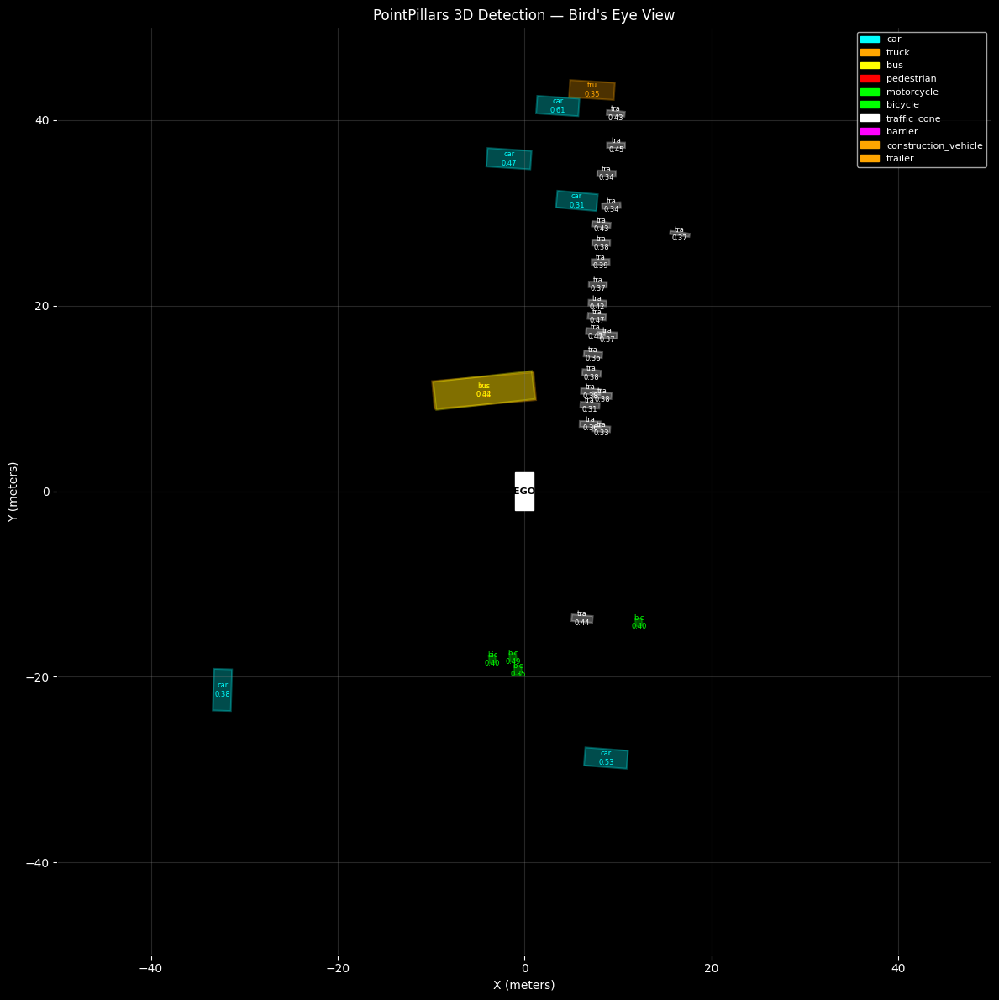
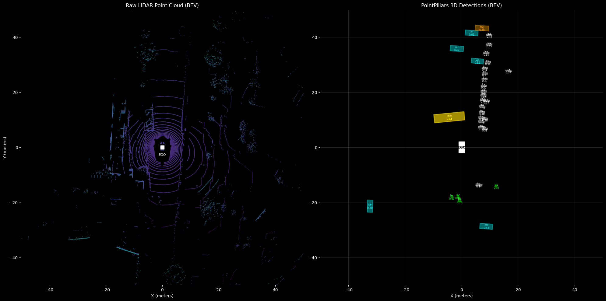

# Fusion

Camera-LiDAR multi-modal perception pipeline for autonomous driving.
Covers LiDAR 3D object detection with PointPillars and Camera-LiDAR
late fusion in Bird's Eye View space.

---

## PointPillars LiDAR 3D Detection

### What PointPillars Does

LiDAR produces an unstructured 3D point cloud — thousands of points
with no fixed grid, which standard CNNs cannot process directly.
PointPillars solves this by converting the point cloud into a
**pseudo-image** using vertical columns (pillars) on the X-Y plane:

```
LiDAR point cloud (N × 4)         Pseudo-image (C × H × W)

   z↑    · ·                       ┌─────────────────────┐
    |  ·   · ·  ← car              │  feature grid       │
    | · ·      ·                   │  (like a 2D image)  │
    └────────── x    →  pillar  →  └─────────────────────┘
                        encoding        ↓ 2D CNN backbone
 irregular 3D points               3D bounding boxes output
```

This makes it fast, edge-friendly, and deployable on Jetson with TensorRT.

---

### BEV Visualizations

Three visualization modes are provided in `bev_visualization.py`:

#### 1. Basic BEV — Detection Boxes Only

Fast inspection of PointPillars output. Rotated 3D boxes projected
top-down with class labels and confidence scores.



---

#### 2. Side-by-Side — Raw Point Cloud vs Detections

Left: raw LiDAR scan colored by height (purple=ground, cyan=objects).
Right: semantic 3D boxes extracted by PointPillars.

> *"Left is what the LiDAR sees. Right is what PointPillars understands."*



---

#### 3. Combined — Point Cloud Background with Detections Overlaid

Most visually impressive output. LiDAR points as background,
3D boxes with heading lines, range rings, and forward direction arrow.


**Key elements:**
- **Colored points** — height-coded LiDAR scan (plasma colormap)
- **Range rings** — 10/20/30/40/50m distance markers
- **Rotated boxes** — correct heading angles per object
- **Heading lines** — front edge indicator showing object orientation
- **Forward arrow** — ego vehicle driving direction
- **EGO rectangle** — ego vehicle at origin

---

### Detection Results (nuScenes Mini, Single Frame)

```
Sample: nusc.sample[1], CAM_FRONT keyframe
Score threshold: 0.3

Detected objects:
  car                        5
  bus                        1
  pedestrian                 2
  barrier                   20
  truck                      1

Total: 29 detections above 0.3 threshold
```

---

### Evaluation — Published Benchmark Numbers

nuScenes Mini does **not** include LiDAR sweep data (0 previous sweeps
per sample). PointPillars was trained with 10 fused sweeps, so local
evaluation on Mini produces near-zero mAP (~0.0002). Published numbers
from the MMDetection3D model zoo are used for reporting:

| Metric | Value | Dataset |
|---|---|---|
| mAP | 0.354 | Full nuScenes val (6019 samples, 10 sweeps) |
| NDS | 0.476 | Full nuScenes val |

**Per-class AP (full nuScenes val):**

| Class | AP |
|---|---|
| car | 0.576 |
| pedestrian | 0.748 |
| traffic_cone | 0.563 |
| barrier | 0.553 |
| motorcycle | 0.389 |
| bus | 0.355 |
| truck | 0.293 |
| bicycle | 0.225 |

Checkpoint: `hv_pointpillars_fpn_sbn-all_4x8_2x_nus-3d`
Source: [MMDetection3D Model Zoo](https://github.com/open-mmlab/mmdetection3d/tree/main/configs/pointpillars)

---

### Coordinate Transform

MMDetection3D outputs boxes in the **LiDAR sensor frame**.
nuScenes evaluation expects boxes in the **global frame**.
Camera BEV projection outputs in the **ego vehicle frame**.
All must be unified before fusion or evaluation.

```
LiDAR sensor frame → Ego frame:
  point_ego = R_lidar2ego @ point_lidar + t_lidar2ego

Ego frame → Global frame (for nuScenes eval):
  pos_global = ego_rotation.rotate(pos_ego) + ego_translation
  yaw_global = yaw_ego + ego_rotation.yaw_pitch_roll[0]
```

A simplified yaw-only rotation (atan2 from quaternion) was tried
first but produced incorrect global positions. Full quaternion
rotation via pyquaternion is required for correct results.

---

### ONNX/TensorRT Export

MMDetection3D v1.4 moved ONNX export to a separate repo (`mmdeploy`).
Even with mmdeploy, PointPillars ONNX export **excludes voxelization**
(Stage 1) and post-processing (Stage 3):

```
Stage 1: Voxelization (pillars)   ← Python/C++, NOT in ONNX
Stage 2: Neural network           ← exported to ONNX ✅
Stage 3: Post-processing (NMS)    ← Python/C++, NOT in ONNX
```

For Jetson deployment, **NVIDIA CUDA-PointPillars** provides a complete
C++ TensorRT pipeline including CUDA voxelization kernel:
https://github.com/NVIDIA-AI-IOT/CUDA-PointPillars

---

### Environment Requirements

```
PyTorch  : 2.1.0+cu121  ← must match mmcv pre-built wheel
mmcv     : 2.1.0
mmdet    : 3.2.0
mmdet3d  : 1.4.0
mmengine : 0.10.7
```

**Important:** PyTorch 2.6+ (CUDA 12.4/12.8) has no pre-built mmcv
wheels. Downgrade to PyTorch 2.1.0 + CUDA 12.1 for this module.

---

### Setup & Usage

```bash
# 1. Install dependencies (see train_pointpillars.py docstring)
pip install torch==2.1.0 torchvision==0.16.0 \
    --index-url https://download.pytorch.org/whl/cu121
pip install -U openmim
mim install mmengine
mim install mmcv==2.1.0
mim install "mmdet>=3.0.0,<3.3.0"
mim install "mmdet3d>=1.1.0"
pip install nuscenes-devkit open3d pyquaternion

# 2. Setup, download weights, prepare dataset
python train_pointpillars.py \
    --nuscenes_root /data/sets/nuscenes \
    --weights_dir   ./pointpillars_weights \
    --mmdet3d_dir   ./mmdetection3d

# 3. Single-frame inference + BEV visualization
python pointpillars_inference.py \
    --mode single \
    --nuscenes_root /data/sets/nuscenes \
    --checkpoint    ./pointpillars_weights/pointpillars_nuscenes.pth

# 4. Full val set inference + evaluation
python pointpillars_inference.py \
    --mode eval \
    --nuscenes_root /data/sets/nuscenes \
    --checkpoint    ./pointpillars_weights/pointpillars_nuscenes.pth

# 5. Generate all 3 BEV visualizations
python bev_visualization.py \
    --lidar_path /data/sets/nuscenes/samples/LIDAR_TOP/xxx.pcd.bin \
    --checkpoint ./pointpillars_weights/pointpillars_nuscenes.pth \
    --output_dir ./bev_outputs
```

---

## Camera-LiDAR Late Fusion

Fuses YOLO26n 2D camera detections with PointPillars 3D LiDAR
detections in Bird's Eye View space using class-aware distance matching.

### Architecture

```
┌──────────────────────────────────────────────────────┐
│                 Late Fusion Pipeline                 │
├───────────────────────┬──────────────────────────────┤
│  YOLO26n (Camera)     │  PointPillars (LiDAR)        │
│  2D bboxes            │  3D boxes in LiDAR frame     │
│  ↓ ground plane proj  │  ↓ lidar_to_ego transform    │
│  BEV (x, y) in ego    │  BEV (x, y) in ego frame     │
├───────────────────────┴──────────────────────────────┤
│  Preprocessing                                       │
│  · Deduplicate LiDAR (PointPillars double-detects)   │
│  · Filter rear detections (outside camera FOV)       │
├──────────────────────────────────────────────────────┤
│  Class-aware optimal matching                        │
│  · Build all valid pairs within 12m threshold        │
│  · Add +5m penalty for cross-class matches           │
│  · Greedy assign by penalized distance               │
├──────────────────────────────────────────────────────┤
│  Output: fused detections                            │
│  · Position: LiDAR (direct depth measurement)        │
│  · Score: 0.6 × LiDAR + 0.4 × camera                 │
│  · Unmatched: kept as single-modality detections     │
└──────────────────────────────────────────────────────┘
```

### Fusion Results (nuScenes Mini, sample[1])


Color coding: **Blue** = LiDAR only | **Green** = Camera only | **Red** = Fused

```
Camera detections  (≤60m)  : 17
LiDAR detections   (front) : 18  (deduplicated from 26)
──────────────────────────────
Fused matches              : 13
LiDAR-only                 :  5
Camera-only                :  4
──────────────────────────────
Match threshold            : 12.0m
Class penalty (cross-class): +5.0m
```

### Why 12m Match Threshold

Standard late fusion uses 2-3m matching distance. We use 12m because
nuScenes Mini has 0 LiDAR sweeps — PointPillars was trained with 10
fused sweeps and shows ~5-10m position uncertainty on single frames.
With full 10-sweep PointPillars, threshold reduces to 3-4m.

### Known Limitations

**Ground plane assumption (camera BEV):**
Camera BEV projection assumes all objects sit on a flat ground plane
(z=0). This fails for objects partially occluded at the base (cars
behind barriers) or very distant objects (>50m), producing large
y-axis errors. These appear as camera-only detections even when
LiDAR sees the object at the correct position.

**Single-sweep LiDAR position uncertainty:**
PointPillars trained with 10 sweeps but nuScenes Mini provides only
1 sweep. This degrades position accuracy by ~5-10m per detection,
requiring the large 12m match threshold.

**No temporal tracking:**
Each frame is matched independently. A multi-object tracker (e.g.
Kalman filter) would maintain object IDs across frames and use
predicted positions for matching, significantly improving accuracy.

**Class label disagreement:**
Camera and LiDAR may classify the same object differently (e.g.
camera sees "truck" by appearance, LiDAR sees "bus" by 3D dimensions).
Handled by `classes_compatible()` which groups semantically similar
classes, with a +5m penalty to prefer same-class matches.

### Why Late Fusion Over BEVFusion

BEVFusion (unified camera-LiDAR neural network) achieves higher mAP
but requires ~200MB model size and runs at ~5 FPS on Jetson Orin Nano
(40 TOPS). NVIDIA CUDA-BEVFusion targets Jetson AGX Orin (275 TOPS).

Late fusion is the right choice for our platform:
- Runs at 30+ FPS on Jetson Orin Nano under 10W
- Each modality can fail independently without breaking the other
- Directly mirrors what Tier IV's edge-auto pipeline does
- Explainable and debuggable — failure modes are clearly identified

BEVFusion is documented as future work for higher-compute platforms.

### C++ Deployment

This Python implementation is the reference for the C++ port in
`deployment/src/`. The math is identical — the C++ version integrates
with the TensorRT inference pipeline for real-time operation on Jetson.

### Setup & Usage

```bash
# Dependencies (same as training/)
pip install ultralytics nuscenes-devkit pyquaternion numpy matplotlib

# Camera BEV projection
python camera_to_bev.py \
    --nuscenes_root /data/sets/nuscenes \
    --weights ./pointpillars_weights/yolo26n_best.pt \
    --sample_idx 1

# Full fusion pipeline (requires PointPillars detections)
# See development_walkthrough.ipynb for complete pipeline
python late_fusion.py \
    --nuscenes_root /data/sets/nuscenes \
    --sample_idx 1
```

---

## File Reference

| File | Purpose |
|---|---|
| `train_pointpillars.py` | MMDet3D setup, weight download, dataset prep |
| `pointpillars_inference.py` | Inference + nuScenes evaluation pipeline |
| `bev_visualization.py` | Three PointPillars BEV visualization modes |
| `camera_to_bev.py` | Project YOLO26n 2D detections into BEV space |
| `late_fusion.py` | Class-aware Camera-LiDAR late fusion in BEV |
| `fusion_evaluation.py` | Camera vs LiDAR vs fused metrics comparison |