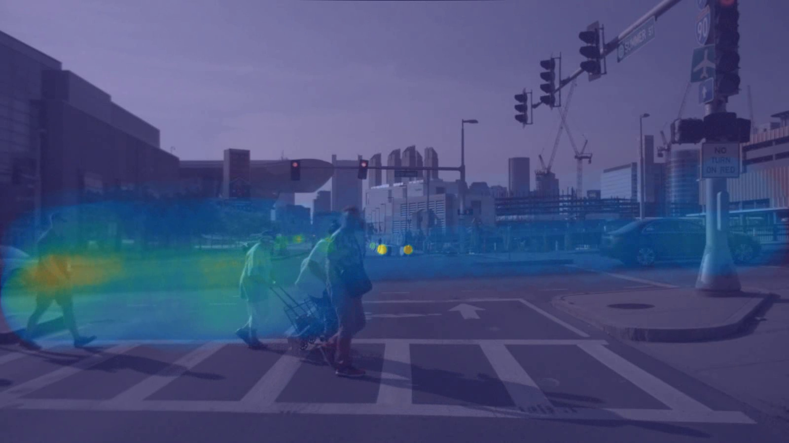
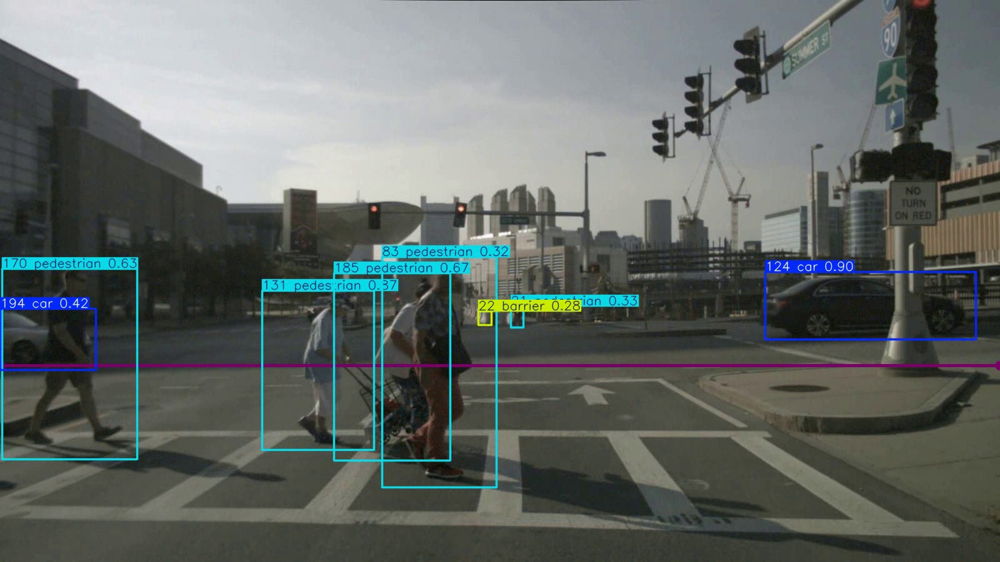
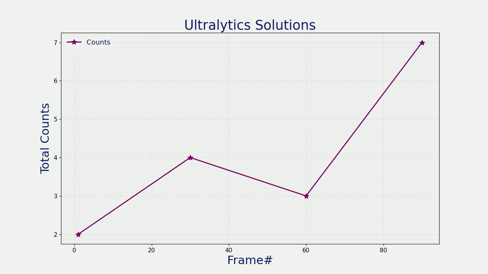
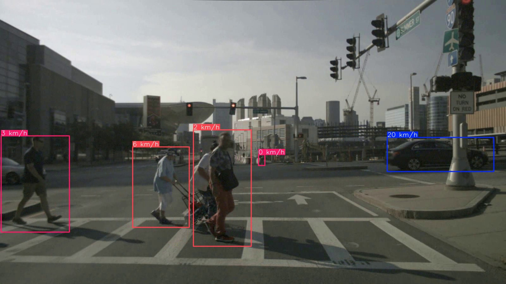
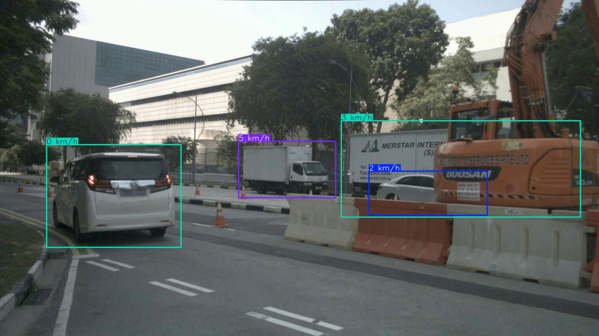
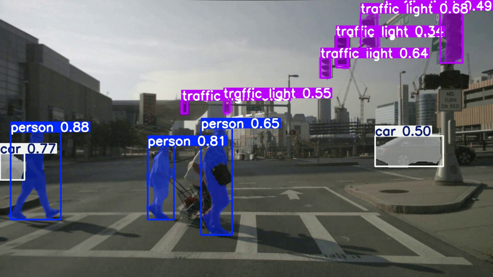
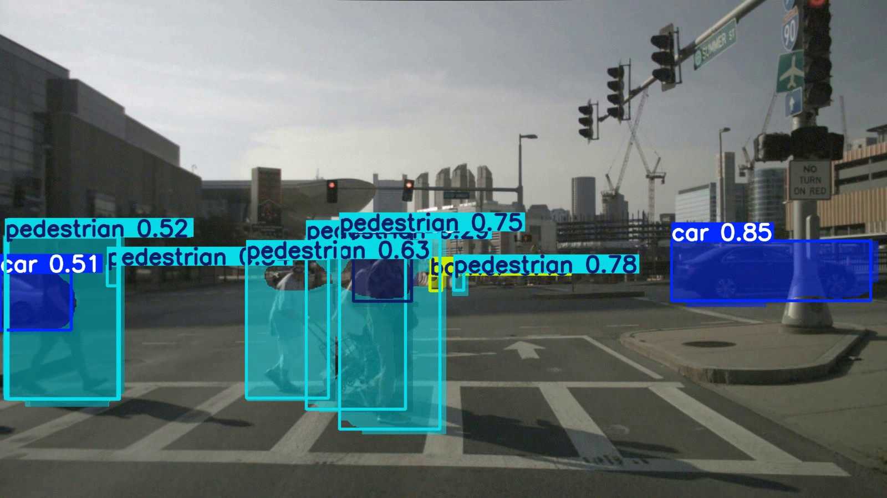

# Solutions

Higher-level perception analytics built on top of YOLO26n detection,
running on nuScenes front-camera driving sequences.

These solutions demonstrate that perception output is **actionable** —
not just bounding boxes, but traffic intelligence fed into higher-level
driving analytics.

---

## Results

| Solution | Works on Moving Camera | Output |
|---|---|---|
| Speed Estimation | ⚠️ Ego-stopped frames only | Per-object km/h overlay |
| Heatmap | ✅ | Traffic density accumulation map |
| Object Counting | ✅ | IN/OUT counts across a defined line |
| Analytics | ✅ | Real-time detection count chart |
| Segmentation (COCO) | ✅ | Pixel-perfect instance masks |
| Segmentation (nuScenes) | ✅ | Approximate masks, nuScenes classes |

---

## Demo Screenshots

### Heatmap
Traffic density accumulated over a full nuScenes driving sequence.
Blue = sparse, yellow = dense. Objects ahead of the vehicle accumulate
the most heat — reflecting the forward-facing camera FOV.



---

### Object Counting
Horizontal counting line at 65% of frame height. Objects crossing
top→bottom are counted IN, bottom→top counted OUT.



---

### Analytics
Real-time line chart of detection counts per class over the driving
sequence. Spikes correspond to frames with high object density
(intersections, pedestrian crossings).



---

### Speed Estimation
Calibrated using nuScenes camera intrinsics (fx=1266.4px).
`meter_per_pixel=0.0040` calibrated for objects at ~5m depth.

**Stationary camera (ego stopped at traffic light) — accurate:**



**Moving camera (ego driving) — inaccurate, ego motion included:**



This side-by-side demonstrates why Camera-LiDAR fusion is needed for
accurate speed estimation on a moving platform. See the
[Known Limitation](#speed-estimation--known-limitation) section below.

---

### Segmentation — Base COCO Weights
Pixel-perfect instance masks using base COCO-pretrained YOLO26n-seg.
Superior visual quality on common classes (car, pedestrian, bicycle).
Does NOT detect traffic_cone or barrier.



---

### Segmentation — Fine-Tuned nuScenes Weights
Approximate masks from fine-tuned YOLO26n-seg trained on nuScenes Mini.
Mask shape reflects the convex hull label quality (see label note below).
Detects barrier correctly; traffic_cone absent from nuScenes Mini data.



---

## Setup

Export nuScenes scenes as video first (required before running any solution):
```bash
python export_nuscenes_video.py \
    --nuscenes_root /data/sets/nuscenes \
    --output_dir ./videos \
    --version v1.0-mini
```

Run all solutions at once:
```bash
python run_all_solutions.py \
    --model_det ./runs/yolo26n_nuscenes/weights/best.pt \
    --model_seg ./runs/yolo26n_seg_nuscenes/weights/best.pt \
    --video     ./videos/scene_02_scene-0553.mp4 \
    --output    ./solutions_output
```

Or run individual solutions:
```bash
python heatmap_demo.py \
    --model ./runs/yolo26n_nuscenes/weights/best.pt \
    --video ./videos/scene_00_scene-0061.mp4

python object_counting_demo.py \
    --model    ./runs/yolo26n_nuscenes/weights/best.pt \
    --video    ./videos/scene_00_scene-0061.mp4 \
    --region_y 0.65

python analytics_demo.py \
    --model ./runs/yolo26n_nuscenes/weights/best.pt \
    --video ./videos/scene_00_scene-0061.mp4

python speed_estimation_demo.py \
    --model           ./runs/yolo26n_nuscenes/weights/best.pt \
    --video           ./videos/scene_02_scene-0553.mp4 \
    --meter_per_pixel 0.0040

python segmentation_demo_coco.py \
    --video ./videos/scene_00_scene-0061.mp4

python segmentation_demo.py \
    --model  ./runs/yolo26n_seg_nuscenes/weights/best.pt \
    --video  ./videos/scene_00_scene-0061.mp4 \
    --suffix nuscenes
```

---

## Speed Estimation — Known Limitation

SpeedEstimator assumes a **stationary camera** (fixed CCTV / intersection).
On a moving dashcam platform like nuScenes, raw pixel displacement includes
ego vehicle motion, producing incorrect absolute speeds for most frames.

**Root cause:**
```
Stationary camera:                Moving camera (nuScenes):
  Billboard: 0px moved → 0 km/h    Billboard: 50px moved → 40 km/h ❌
  Car: 30px moved → correct ✅      Car: 5px moved → too slow ❌
```

**meter_per_pixel calibration** (nuScenes CAM_FRONT, fx=1266.4px):

| Object depth | meter_per_pixel | Pedestrian result |
|---|---|---|
| 5m | 0.0040 | ~5 km/h ✅ |
| 10m | 0.0079 | ~10 km/h (too high) |
| 15m | 0.0118 | ~15 km/h (too high) |

Default `0.0040` is calibrated for near-stopped ego with objects at ~5m.

**Production solution:** Camera-LiDAR fusion provides per-object LiDAR
depth, enabling accurate speed estimation regardless of object distance
or camera motion. See [`fusion/`](../fusion/README.md).

---

## Segmentation — Label Quality Note

Two segmentation models are used for complementary purposes:

**Base COCO YOLO26n-seg (`yolo26n-seg.pt`)**
- Pixel-perfect masks trained on 118k COCO images with polygon annotations
- Superior visual quality on cars, pedestrians, bicycles
- Missing: `traffic_cone`, `barrier` (not in COCO 80 classes)
- Use for: visual demos, mask quality showcase

**Fine-tuned YOLO26n-seg (`best.pt` from training)**
- Trained on nuScenes Mini with convex hull polygon labels
- Detects `barrier` correctly; `traffic_cone` absent from mini data
- Mask quality is approximate — labels were projected 3D box corners,
  not pixel-level annotations (nuScenes does not provide 2D masks)
- Use for: nuScenes class coverage, benchmark evaluation

**Production goal:** Fine-tune on nuScenes-panoptic labels for
pixel-perfect masks + full nuScenes class coverage.

---

## File Reference

| File | Purpose |
|---|---|
| `export_nuscenes_video.py` | Export nuScenes scenes as smooth MP4 (keyframes + sweeps) |
| `speed_estimation_demo.py` | SpeedEstimator with calibrated meter_per_pixel |
| `heatmap_demo.py` | Traffic density heatmap accumulation |
| `object_counting_demo.py` | Zone-based IN/OUT object counting |
| `analytics_demo.py` | Real-time detection count line chart |
| `segmentation_demo_coco.py` | Instance masks using base COCO weights |
| `segmentation_demo.py` | Instance masks using fine-tuned nuScenes weights |
| `run_all_solutions.py` | Run all solutions sequentially with one command |